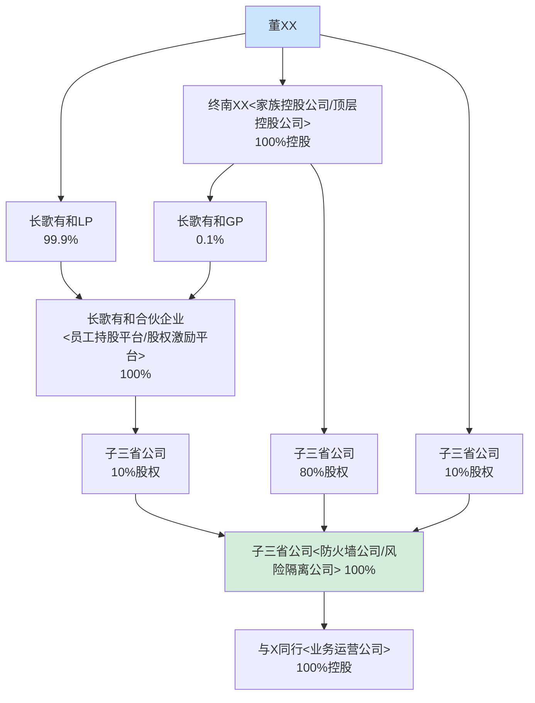
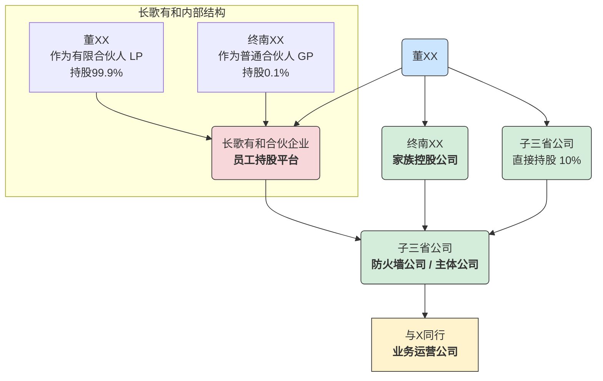

### 董宇辉公司持股关系图

```mermaid
flowchart TD
    Dong[董XX] --> ZN[终南XX<家族控股公司/顶层控股公司><br>100%控股]
    Dong --> GHYH_GP[长歌有和LP<br>99.9%]
    ZN --> GHYH_LP[长歌有和GP<br>0.1%]

    GHYH_GP & GHYH_LP --> GHYH[长歌有和合伙企业<br><员工持股平台/股权激励平台><br>100%]
    
    GHYH --> ZSX_LP[子三省公司<br>10%股权]
    ZN --> ZSX_GP[子三省公司<br>80%股权]
    Dong --> ZSX_Direct[子三省公司<br>10%股权]
    
    ZSX_LP & ZSX_GP & ZSX_Direct --> ZSX[子三省公司<防火墙公司/风险隔离公司> 100%]
    
    ZSX --> YXTX[与X同行<业务运营公司><br>100%控股]

    style Dong fill:#cce5ff
    style ZSX fill:#d4edda
```

### 不同形式绘制同样的关系图

```mermaid
flowchart TD
    %% 定义节点样式
    classDef person fill:#cce5ff,stroke:#333,stroke-width:1px
    classDef holdingCo fill:#d4edda,stroke:#333,stroke-width:1px
    classDef operatingCo fill:#fff3cd,stroke:#333,stroke-width:1px
    classDef partnership fill:#f8d7da,stroke:#333,stroke-width:1px

    %% 第一层：创始人
    A(董XX):::person

    %% 第二层：直接持股和控股平台
    A --> B(终南XX<br><b>家族控股公司</b>):::holdingCo
    A --> C(长歌有和合伙企业<br><b>员工持股平台</b>):::partnership
    A --> D(子三省公司<br>直接持股 10%):::holdingCo

    %% 第三层：揭示合伙企业内部结构
    subgraph SG [长歌有和内部结构]
        C1[董XX<br>作为有限合伙人 LP<br>持股99.9%] --> C
        C2[终南XX<br>作为普通合伙人 GP<br>持股0.1%] --> C
    end

    %% 第四层：核心防火墙公司
    B --> E(子三省公司<br><b>防火墙公司 / 主体公司</b>):::holdingCo
    C --> E
    D --> E

    %% 第五层：业务运营实体
    E --> F[与X同行<br><b>业务运营公司</b>]:::operatingCo
```
